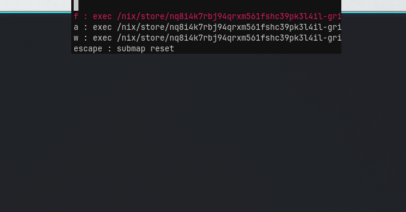

Implementation of which-key for hyprland's submaps. Shows a menu with this
submap's key mappings:

*NOTE*: this project is very much in alpha stage. See TODOs below.

# TODO

- [X] Proper pre-commit/format stuff
- [ ] Nix package
- [ ] Add a sane way to show aliases
- [ ] Try to cover with tests as much as possible
- [ ] Nix modules (checks?)
- [ ] A proper UI instead of horrible echo-into-bemenu hack
- [ ] Gif of project
